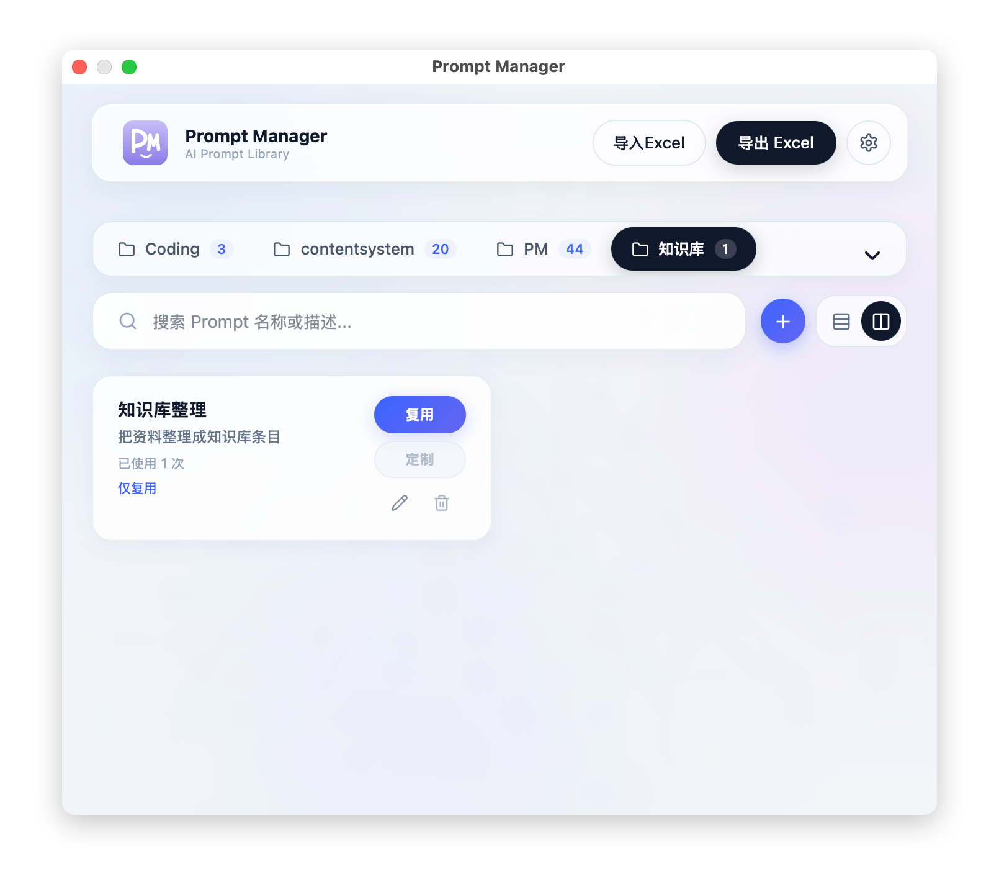

# Prompt Manager

一个本地优先的 Prompt 管理工具。把常用 Prompt 按分类保存起来，在当前软件上方快速唤出，填写变量后复制或自动粘贴到正在使用的输入框。



## 功能特色

- 分类管理：按工作流、内容类型或团队场景整理 Prompt。
- 变量填充：在 Prompt 中使用 `{{字段名}}` 标记每次调用前需要填写的内容。
- 复用与定制：支持“复用 Prompt”和“定制 Prompt”两种内容，兼顾固定模板和按需填写。
- 快速调用：Mac 端可用 `⌥Space` 在当前软件上方唤出工具，选择 Prompt 后复制或粘贴到目标应用。
- AI 填入字段：配置模型 API Key 后，可把关键词或简短需求改写成各字段内容。
- 上次调用恢复：同一个 Prompt 最近一次 AI 填入的字段值可以快速恢复。
- Excel 导入导出：可导出模板、导出历史记录，也可从 Excel 批量导入 Prompt。
- 本地存储：Prompt 数据保存在本机，不依赖服务器保存个人内容。

## 下载安装

安装包由 GitHub Actions 自动构建，并发布到 GitHub Releases：

| 系统 | 安装包 | 下载 |
|---|---|---|
| Mac | `PromptManager-macOS.dmg` | [下载 Mac 安装包](https://github.com/Abigale-cyber/Prompt_Manager/releases/latest/download/PromptManager-macOS.dmg) |
| Windows | `PromptManager-Windows-x64.exe` | [下载 Windows 安装包](https://github.com/Abigale-cyber/Prompt_Manager/releases/latest/download/PromptManager-Windows-x64.exe) |

如果下载链接暂时不可用，说明最新构建还没有完成。可以打开仓库顶部的 **Actions**，进入最新成功的 **Build Installers** 工作流，在页面底部 **Artifacts** 下载对应安装包。

## Mac 安装

1. 下载 `PromptManager-macOS.dmg`。
2. 打开 `PromptManager-macOS.dmg`。
3. 把 `PromptManager.app` 拖到 `Applications`。
4. 从 `Applications` 启动 `PromptManager.app`。

当前 DMG 未做 Apple Developer ID 公证。第一次打开时，如果 macOS 提示无法验证开发者，右键点击 `PromptManager.app`，选择“打开”，再确认一次。

自动粘贴到其他应用需要 macOS 辅助功能权限。首次调用失败时，请到 **系统设置 > 隐私与安全性 > 辅助功能** 中允许 `Prompt Manager`。

## Windows 安装

1. 下载 `PromptManager-Windows-x64.exe`。
2. 运行 `PromptManager-Windows-x64.exe`。
3. 按安装向导完成安装。
4. 从开始菜单或桌面快捷方式启动 `Prompt Manager`。

## 使用方法

1. 点击 `+` 新增 Prompt，选择或新建分类。
2. 在“复用 Prompt”中填写可直接调用的完整内容。
3. 在“定制 Prompt”中使用 `{{字段名}}` 标记需要调用前填写的变量，例如 `请基于 {{主题}} 写一份 {{平台}} 文案`。
4. 点击“调用”，填写变量后复制，或发送到当前正在使用的输入框。
5. 需要批量迁移时，使用“导出 Excel”备份，再用“导入 Excel”恢复。

## 快速开始

```bash
# 克隆项目
git clone https://github.com/Abigale-cyber/Prompt_Manager.git

# 进入项目目录
cd Prompt_Manager

# 安装依赖
npm install

# 启动开发服务器
npm run dev
```

本地开发地址通常为 `http://127.0.0.1:5173`。如果端口被占用，请以终端输出为准。

## 本地构建

```bash
# 构建 Web 资源
npm run build

# 打包 Mac DMG
npm run package:mac

# 打包 Windows 安装包
npm run package:windows
```

## 技术栈

- 前端框架：React 18
- 构建工具：Vite 6
- 桌面端：Electron、macOS Swift 原生壳、electron-builder
- UI 与交互：MUI、Radix UI、lucide-react
- 数据导入导出：Excel 模板、Excel 历史记录导入导出

## 本地数据

Prompt 数据保存在本机浏览器存储中，不会上传到服务器。更换电脑或清理浏览器数据前，请点击“导出 Excel”，选择“导出历史记录”备份当前 Prompt 库；到新电脑后再用“导入 Excel”恢复。

需要空白填写表时，选择“导出模板”。导入时支持 `分类`、`标题`、`简介`、`复用Prompt`、`定制Prompt` 表头，也兼容部分英文表头。

## 项目说明

- 本项目用于个人或团队内部 Prompt 管理，适合高频复用写作、运营、研发、客服等工作流模板。
- API Key 仅用于本机向你配置的模型服务发起请求，请自行保管密钥。
- 当前安装包由 GitHub Actions 自动发布到 `latest` Release。

## 联系方式

如需反馈问题、交流使用方法或获取更新，可以扫码添加个人微信：


